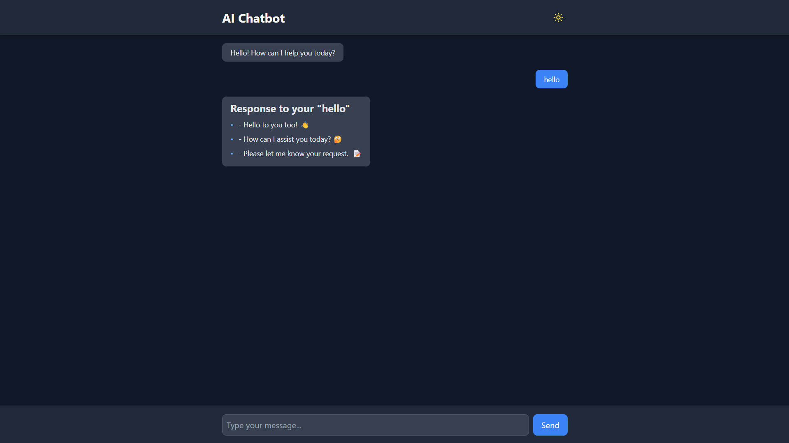

# AI ChatBot

Welcome to the AI ChatBot project! This chatbot leverages the **Gemini API** to provide intelligent and conversational AI responses. Designed with a modern user interface using **Tailwind CSS** and enhanced iconography with **Lucide**, this chatbot ensures a seamless and visually appealing user experience.

## Screenshot of AI ChatBot



## Features

- **Gemini API Integration**: Delivers accurate and context-aware responses.
- **Responsive UI**: Built with Tailwind CSS for optimal performance on all devices.
- **Enhanced Iconography**: Utilizes Lucide for a crisp and modern look.
- **Dynamic Question Handling**: Capable of answering a wide range of questions efficiently.

## Prerequisites

To run this project, ensure you have the following installed:

- [Node.js](https://nodejs.org/) (v14 or higher)
- [npm](https://www.npmjs.com/) or [yarn](https://yarnpkg.com/)

## Installation

1. **Clone the repository:**

   ```bash
   git clone https://github.com/Tanjiro24/ai-chatbot.git
   cd ai-chatbot
   ```

2. **Install dependencies:**

   ```bash
   npm install
   # or
   yarn install
   ```

3. **Set up environment variables:**
   Create a `.env` file in the root directory and add your Gemini API key:
   ```env
   GEMINI_API_KEY=your-api-key
   ```

## Usage

1. **Start the development server:**

   ```bash
   npm run dev
   # or
   yarn dev
   ```

2. **Access the chatbot:**
   Open your browser and navigate to `http://localhost:3000`.

## Technologies Used

- **Gemini API**: Powers the AI capabilities.
- **Tailwind CSS**: For responsive and modern UI design.
- **Lucide Icons**: Lightweight SVG icon library.
- **React.js**: Component-based architecture for building the UI.

## Contributing

Contributions are welcome! To contribute:

1. Fork the repository.
2. Create a new branch (`git checkout -b feature-name`).
3. Commit your changes (`git commit -m 'Add feature'`).
4. Push to the branch (`git push origin feature-name`).
5. Open a pull request.
